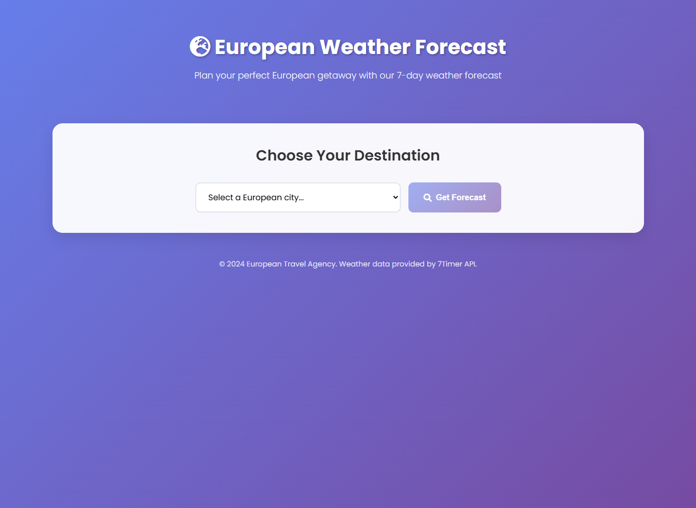
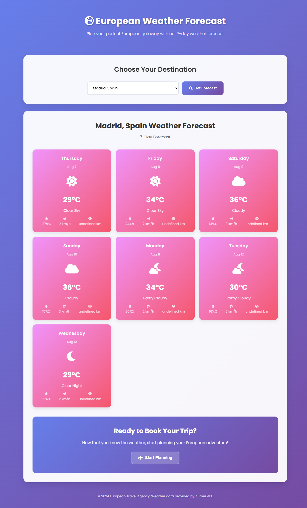

# European Weather Forecast Website

A modern, responsive weather forecast website for a European travel agency that helps increase travel bookings by providing 7-day weather forecasts for major European cities.

## 🌟 Features

- **7-Day Weather Forecast**: Get detailed weather information for major European cities
- **Modern UI/UX**: Beautiful, responsive design with smooth animations
- **Real-time API Integration**: Uses 7Timer API for accurate weather data
- **Error Handling**: Graceful error handling with user-friendly messages
- **Mobile Responsive**: Works perfectly on all device sizes
- **Accessibility**: Keyboard navigation and screen reader support

## 📸 Showcase Screenshots

### Main Interface

*Clean, modern interface with city selection and weather forecast display*

### Weather Forecast Display

*7-day weather forecast for London, UK with detailed weather information*

### Madrid Weather Example

*Weather forecast for Madrid, Spain showing different weather conditions*

## 🏙️ Supported Cities

- London, UK
- Paris, France
- Rome, Italy
- Madrid, Spain
- Berlin, Germany
- Amsterdam, Netherlands
- Vienna, Austria
- Prague, Czech Republic
- Budapest, Hungary
- Warsaw, Poland
- Stockholm, Sweden
- Oslo, Norway
- Copenhagen, Denmark
- Helsinki, Finland
- Dublin, Ireland
- Brussels, Belgium
- Zurich, Switzerland
- Munich, Germany
- Barcelona, Spain

## 🛠️ Technologies Used

- **HTML5**: Semantic markup with proper structure
- **CSS3**: Modern styling with Flexbox and Grid
- **JavaScript (ES6+)**: Async/await, DOM manipulation, API integration
- **7Timer API**: Free weather data service
- **Font Awesome**: Icons for weather conditions
- **Google Fonts**: Poppins font family

## 📁 Project Structure

```
├── index.html          # Main HTML file
├── master.css          # CSS styles
├── main.js            # JavaScript functionality
├── test.html          # API testing page
├── README.md          # Project documentation
├── public/
│   ├── png_1.png     # Main interface screenshot
│   ├── png_2.png     # Weather forecast screenshot
│   └── png_3.png     # Madrid weather example
```

## 🚀 Getting Started

1. **Download the files**: All necessary files are included in this project
2. **Open in browser**: Simply open `index.html` in your web browser
3. **Select a city**: Choose from the dropdown menu
4. **Get forecast**: Click "Get Forecast" to see the 7-day weather

## 🔧 How It Works

### API Integration
The website uses the 7Timer API to fetch weather data:
- **Endpoint**: `http://www.7timer.info/bin/api.pl`
- **Parameters**: Latitude, longitude, product type, and output format
- **Response**: JSON data with 7-day forecast

### Data Processing
1. User selects a city from the dropdown
2. JavaScript fetches coordinates for the selected city
3. API call is made to 7Timer with the coordinates
4. JSON response is processed and displayed as weather cards
5. Each card shows temperature, humidity, wind speed, and visibility

### Error Handling
- Network connectivity issues
- API service unavailability
- Invalid data responses
- User input validation

## 🎨 Design Features

- **Gradient Backgrounds**: Beautiful color transitions
- **Card-based Layout**: Clean, organized weather information
- **Hover Effects**: Interactive elements with smooth transitions
- **Loading Animations**: Spinning icons during data fetch
- **Responsive Grid**: Adapts to different screen sizes

## 📱 Responsive Design

The website is fully responsive and works on:
- Desktop computers
- Tablets
- Mobile phones
- Different screen orientations

## 🔍 Browser Compatibility

- Chrome (recommended)
- Firefox
- Safari
- Edge
- Opera

## 📊 Weather Information Displayed

For each day, the website shows:
- **Day and Date**: Current day name and date
- **Weather Icon**: Visual representation of conditions
- **Temperature**: In Celsius
- **Weather Description**: Text description of conditions
- **Humidity**: Percentage
- **Wind Speed**: Kilometers per hour
- **Visibility**: Kilometers

## 🎯 Project Objectives Met

✅ **HTML Proficiency**: Proper semantic HTML structure
✅ **CSS Proficiency**: Responsive design with modern CSS
✅ **JavaScript Proficiency**: Async API calls and DOM manipulation
✅ **Data Processing**: JSON parsing and error handling
✅ **User Experience**: Intuitive interface with loading states

## 🌐 API Documentation

The website uses the 7Timer API:
- **Base URL**: `http://www.7timer.info/bin/api.pl`
- **Product**: `civil` (civil weather forecast)
- **Output**: `json`
- **No API Key Required**: Free to use

## 🚀 Future Enhancements

- Add more European cities
- Include hourly forecasts
- Add weather alerts
- Implement location detection
- Add weather history
- Include travel recommendations based on weather

## 📄 License

This project is created for educational purposes as part of a web development course.

## 👨‍💻 Developer

Created as a web development project demonstrating:
- API integration
- Modern web technologies
- Responsive design
- Error handling
- User experience best practices

---

**Note**: This website is designed to help increase travel bookings by providing valuable weather information to potential travelers, encouraging them to stay on the website longer and consider booking their European adventures. 